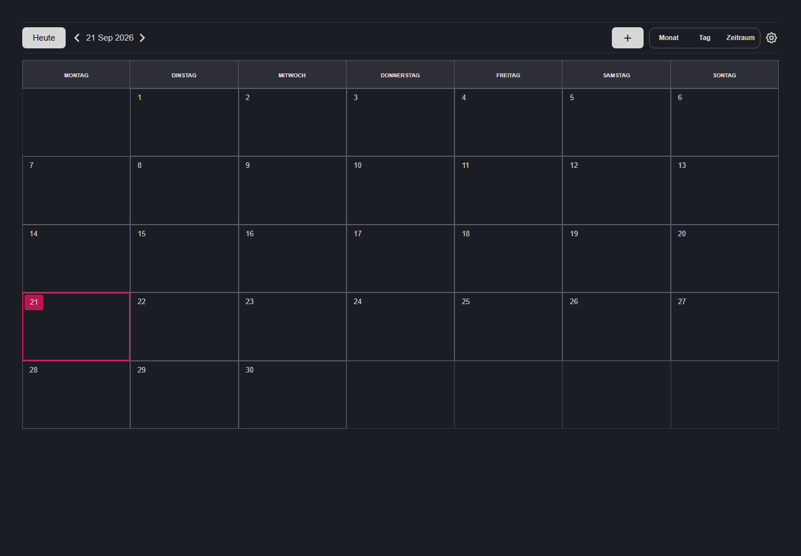

# Kalender Tool

A browser-based calendar application built with React. It provides month, day, and custom-period views, interactive event creation, drag-and-drop scheduling, multi-day events, and explicit local persistence without requiring a backend.

The interface is currently presented in German.



## Features

- Month, day, and configurable period views
- Create events from the add-event dialog
- Double-click a month cell to create an event on that date
- Click and drag across the month grid to create a full-day date range
- Click and drag on the day or period timeline to create a timed event
- Move existing events by dragging their chips
- Resize timed events from their upper and lower handles
- Support for multi-day events and visual continuation across calendar rows
- Two event types:
  - `event` — a top-level **Veranstaltung**
  - `programm` — a **Programmpunkt** linked to a parent event
- Optional breaks, overlap restrictions, and participant/companion flags
- Soft deletion and an explicit save workflow
- Browser-local persistence through `localStorage`
- Unsaved-change protection before leaving or reloading the page

## Calendar Views

| View | Purpose | Creation interaction |
| --- | --- | --- |
| Month (`Monat`) | Overview of a complete month and multi-day ranges | Double-click a cell for one date, or drag across cells for a full-day range |
| Day (`Tag`) | Detailed 24-hour timeline for one date | Drag vertically to select a timed period |
| Period (`Zeitraum`) | Detailed timeline across a custom date range | Drag vertically and across date columns |

Double-clicking an existing event chip opens that event for editing instead of creating a new event.

## Tech Stack

- React 18
- Material UI 6 and Emotion
- Tailwind CSS 3
- Webpack 5 and Webpack Dev Server
- Babel
- Plain JavaScript and JSX

React, ReactDOM, and Tailwind's browser runtime are served from the repository's `lib/` directory during development. No external API or database is required.

## Requirements

- Node.js 18 or newer
- npm
- A modern browser with `localStorage` support

## Getting Started

Clone the repository and install its dependencies:

```bash
git clone <repository-url>
cd kalender-tool
npm install
```

Start the development server:

```bash
npm start
```

The application is served at:

```text
http://localhost:8887
```

The development server supports history fallback and rebuilds the application when source files change.

## Production Build

Create an optimized production bundle with:

```bash
npm run build
```

Webpack writes the generated application to `dist/`:

```text
dist/
├── index.html
├── main.js
└── styles.css
```

Serve the contents of `dist/` together with the required static files from `lib/`. The generated HTML expects the local React and Tailwind assets to be available at `/react/...` and `/tailwind/...`.

## Using the Calendar

### Creating an event

You can create an event in several ways:

1. Select the `+` button in the header to open a blank event form.
2. Double-click an empty cell in the month view to open the form with that date preselected.
3. Drag across month cells to create a full-day event spanning the selected dates.
4. Drag on the day or period timeline to create a timed event.

After a drag gesture, the event dialog opens so the generated dates, times, type, and other properties can be reviewed before confirmation.

### Editing and moving events

- Double-click an event chip to edit its details.
- Drag an event chip to move it.
- In timeline views, drag the top or bottom event handle to resize its start or end.

### Saving changes

Creating, editing, moving, or deleting an event first stages the change in application state. It does **not** immediately update browser storage.

When pending changes exist, a green save button appears in the header. Select it to commit all staged changes to `localStorage`. Closing or reloading the page before saving triggers the browser's unsaved-change warning.

## Event Model

A calendar entry follows this general structure:

```json
{
  "id": "unique-id",
  "name": "Event name",
  "title": "Optional title",
  "type": "event",
  "targetEventId": "",
  "period": {
    "from": {
      "date": "2026-09-21",
      "time": "09:00"
    },
    "to": {
      "date": "2026-09-21",
      "time": "10:30"
    }
  },
  "breaks": [],
  "attributs": {
    "isFullDay": false,
    "overlapping": false,
    "begleiter": false,
    "teilnehmer": false
  }
}
```

For a `programm` entry, `targetEventId` identifies its parent `event`.

## Local Storage

The application uses the following browser-storage entries:

| Key | Description |
| --- | --- |
| `events` | Persisted calendar events |
| `layout` | Last selected calendar view |
| `periodDateFrom` | Start of the custom period view |
| `periodDateTo` | End of the custom period view |
| `kalender_user_setting` | Period-view display preferences |

Data is specific to the current browser profile and origin. Clearing site data removes the stored calendar and preferences.

## Project Structure

```text
kalender-tool/
├── index.html
├── lib/                         # Browser-served React and Tailwind assets
├── src/
│   ├── assetes/                 # Icon components
│   ├── calender/                # Root calendar composition
│   ├── calender-layouts/        # Month, day, and period views
│   ├── components/
│   │   ├── calender-header/     # Navigation and view controls
│   │   ├── dialogs/             # Add/edit event dialog
│   │   ├── eventChips/          # View-specific event renderers
│   │   └── global/              # Shared UI primitives
│   ├── context/                 # UI state and staged event storage
│   ├── styles/                  # Calendar, modal, and page styles
│   └── ultis/                   # Date, event, and settings helpers
├── package.json
└── webpack.config.js
```

The directory names `calender`, `calender-layouts`, `assetes`, and `ultis` are retained for compatibility with the existing codebase.

## Development Notes

- Keep event dates in `YYYY-MM-DD` format and times in `HH:mm` format.
- Treat `eventsState.eventsList` as persisted entries and `eventsState.newEvents` as staged drafts.
- Use `changeEventListHandler` when a user action should mark the calendar as changed.
- Preserve the explicit save workflow; do not write event changes directly to `localStorage` from UI components.
- Verify changes in all three calendar views because event rendering and drag behavior are view-specific.
- Run a production build before submitting changes:

```bash
npm run build
```

There is currently no automated test or lint script in `package.json`; interaction changes should be verified manually in the browser in addition to running the production build.

## Known Limitations

- Calendar data is stored only in the current browser; there is no account sync or server backup.
- The interface text is currently German and is not yet connected to an internationalization system.
- The project currently targets pointer/mouse interaction and does not provide complete keyboard-based calendar editing.
- Automated tests are not yet configured.

## License

This project is licensed under the MIT License. See [LICENSE.txt](LICENSE.txt) for details.
